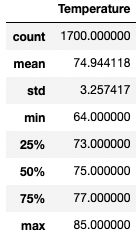
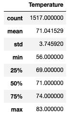

# Surf n' Shake - Weather Analysis

*Prepared for W. Avy - 2021 FEB 28*

## Overview of Analysis

Surf n' Shake is a shop that sells surf boards and milkshakes to tourists and locals alike. The proposals places this shop on the beautiful island of O'ahu.

This analysis is to determine if the success of Surf n' Shake will be negatively impacted by the weather, specifically, the temperatures, and identify whether or not the shop can be open year-round.

## Results

### June

The month of June is typically the start of the warmest-season and therefore could result in many in-bound travel from vacationers as well as outtings from locals, and as such it made sense to perform a more in-depth analysis on the various weather parameters. The chart below provides an overview of the data:

### December

In contrast, the month of December is typically the start of the cooler-season and thus has potential for less  in-bound travel from vacationers and outtings from locals. Performing an in-depth analysis on the various weather parameters was necessary to ensure that even during sub-par travel times, the business venture will be successful. The chart below provides an overview of the data:

### Comparison of June and December Data

From the above charts, three major findings have been noted:

* June, although the start of the warmer-season, was only **3.9** degrees F ***more*** than December, the start of the cooler-season -- this indicates that the change in average temperature for the entirety of each month is not significant, and therefore sales (and thus the success of the Surf n' Shake shop) should not be negatively impacted
* June has had an average high of **85.0** degrees F, while December has an average high of **83.0** degrees F -- the maximum average temperatures of each month only vary by **2.0** degrees F, thus indicating that the change in average temperature for the entirety of each month is not significant, and therefore sales (and thus the success of the Surf n' Shake shop) should not be negatively impacted
* June has had an average low of **64.0** degrees F, while December has had an average low of **56.0** degrees F, meaning that the difference in minimum average temperatures of each month vary by **8.0** degrees F -- this suggests that because the change in average temperature for the entirety of each month is significant, the sales (and thus the success of the Surf n' Shake shop) may potentially be negatively impacted
* It should also be noted that when comapring the differences between June and December for both the max and min temperatures, the max temperatures are similar and the min tempatures are different, suggesting that the month of december has a greater range of temperatures. This is also confirmed with the fact that the standard deviation (the spread of the temperature data distribution) for December is much greater than June, meaning the temperature has a greater potential to drop/raise -- this should be taken into account for any months with a greater standard deviation

## Summary

In summary, it is clear that although there are some differences with the minimum, maximum, and average tempatures between the months of June and December, the overall sales of Surf n' Shake should not be greatly impacted, if at all, in the cooler months, and therefore could be open year-round.

To further enhance the analysis on the success of Surf n' Shop in relation to the temperature, the remaining months of the warmer-season (July and August) as well as the remaining months in the cooler-season (January, February, and March) should be analyzed to develop more concrete findings for other potential investors.

Additionally, the surrounding islands of Maui, Hawai'i, and Kaua'i should be analyzed to determine if a chain of shops is in the near future of Surf n' Shake.
